#2021-01-12 

| item           | note                                                         |
| -------------- | ------------------------------------------------------------ |
| Journal:       | Sustainability (ISSN 2071-1050)                              |
| Manuscript ID: | sustainability-1485080                                       |
| Type:          | Article                                                      |
| Title:         | NEVs Supply Chain Coordination with Financial Constraint and Demand Uncertainty |
| manuscripts:   | fig1-11. DataSet & Python code                               |
| Code authors:  | Yongjian Li$^*$                                              |
| Last modify:   | 2021-01-12                                                   |
| version:       | Python 3.6.5, sympy >= 1.3                                   |

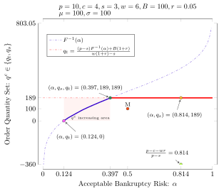

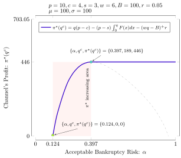

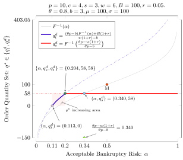

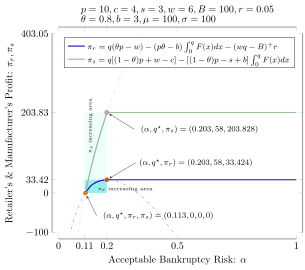

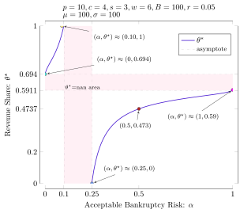

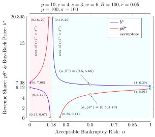

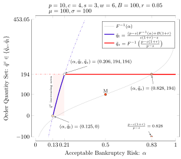

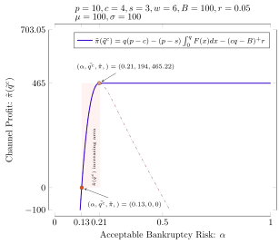

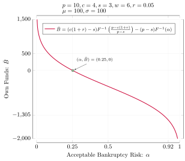

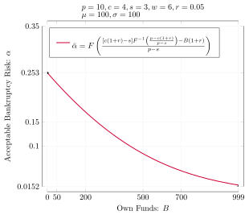

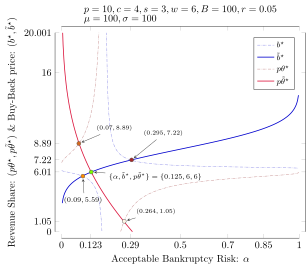